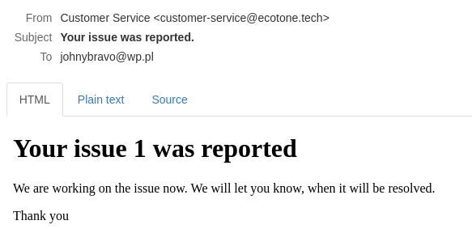

# PHP Applications using DDD CQRS Event Sourcing Symfony, Laravel powered by Ecotone


Demo provides two `PHP Microservices` collaborating with each over [RabbitMQ](https://www.rabbitmq.com/).   
First Microservice is using `Symfony CQRS DDD Aggregates with Doctrine ORM and Event Sourcing` backed by [Prooph](http://getprooph.org/), modeled in Hexagonal Architecture.  
Second Microservice is using `Laravel, DDD Aggregates with Eloquent and asynchronous event handling`.   
Each service is powered by [Ecotone Framework](https://github.com/ecotoneFramework/ecotone)   

# Business usage

Laravel application is Customer Service, where customers can report issues.  

Whenever new issue is reported, email is send to the customer confirming, that Customer Service is now working on it.  


Symfony application provides Backoffice, where we may register employees. 
In Backoffice customer issues are correlated with tickets and employees are responsible for handling them.  

Employee that works on the tickets provides information about the status.
When ticket is finished, it's closed with summary.   

After ticket is closed, correlated issue from Customer Service is also closed and summary email is sent to the customer.  

* Integration between Services implementation and blog post is in progress

# Access applications

- [Customer Service - Laravel](http://localhost:3000)  
- [Backoffice - Symfony](http://localhost:3001)  
- [Mail Server](http://localhost:3004)
- [RabbitMQ Management Console](http://localhost:3005)

# Quick start to get familiar with concepts

* [Symfony and Doctrine ORM as Aggregates](https://blog.ecotone.tech/build-symfony-application-with-ease-using-ecotone/)
* [Laravel and Eloquent as Aggregates](https://blog.ecotone.tech/build-laravel-application-using-ddd-and-cqrs/)
* [How to implement CQRS](https://blog.ecotone.tech/cqrs-in-php/)
* [How to implement Event Handling](https://blog.ecotone.tech/event-handling-in-php/)
* [How to handle Asynchronicity](https://blog.ecotone.tech/asynchronous-php/)
* [How to implement Event Sourcing](https://blog.ecotone.tech/implementing-event-sourcing-php-application-in-15-minutes/)
* [Integrating Microservices](https://blog.ecotone.tech/how-to-integrate-microservices-in-php/)

# Run using docker-compose

Run `docker-compose up -d`

Shell:
```shell
make start  # Starts the containers. `make docker_up_detached` would run it in detached (-d) mode.
make help   # To see the available usage command
make [tab]  # For autocomplete
make sh     # to login to the bash of the app container
# Inside the container
console [tab] # To get all the Symfony's available commands including Ecotone ones
exit
# Outside the container
make db_sql # To access the PostgreSQL command CLI on the database container
make stop   # To stop the containers and their networks (keep their volumes and images)
make reset  # To remove the containers, their networks, their volumes for then restarting from scratch
make clean  # To remove everything from Docker and let your computer as if you never used this repo
```
